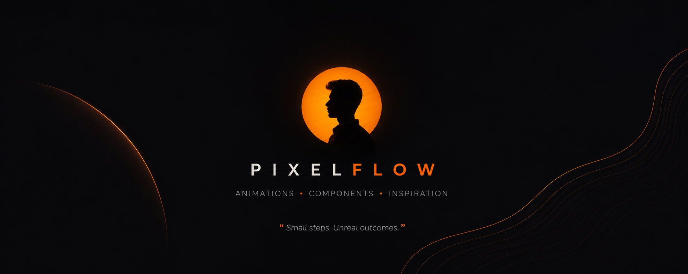

  

 

 

# PixelFlow

**Premium UI, Motion &amp; Frontend Engineering**

We design and build interfaces that feel inevitable — clean systems, considered motion, and components engineers actually want to ship.

 

 

## About

<table>
<tr>
<td width="100%">

PixelFlow is a frontend brand dedicated to premium UI craft — components, animations, and templates built with the same discipline as the products we admire. Every release is designed first, engineered second, and shipped only when it feels right.

**What we build**

&nbsp;&nbsp;&nbsp;&nbsp;· UI Components — production-ready, accessible, themeable
&nbsp;&nbsp;&nbsp;&nbsp;· CSS Animations — micro-interactions and motion systems
&nbsp;&nbsp;&nbsp;&nbsp;· React Components — composable, documented, open source
&nbsp;&nbsp;&nbsp;&nbsp;· Frontend Tutorials — practical, no fluff
&nbsp;&nbsp;&nbsp;&nbsp;· Motion Design — interface animation as a craft
&nbsp;&nbsp;&nbsp;&nbsp;· Open Source — built in public, for developers

</td>
</tr>
</table>

 

## Currently

<table>
<tr>
<td width="100%">

&nbsp;&nbsp;→&nbsp;&nbsp;Building the **PixelFlow Component Library**
&nbsp;&nbsp;→&nbsp;&nbsp;Publishing the **CSS Series**
&nbsp;&nbsp;→&nbsp;&nbsp;Deepening **React** fundamentals
&nbsp;&nbsp;→&nbsp;&nbsp;Studying **motion design** systems
&nbsp;&nbsp;→&nbsp;&nbsp;Shipping in the **open**

</td>
</tr>
</table>

 

## Stack

 

## Featured Work

<table width="100%">
<tr>
<td width="33%" valign="top">

### PixelFlow
**Component Library**

The core system — production-ready UI components, themeable and documented.

`repo →` **coming soon**

</td>
<td width="33%" valign="top">

### CSS Series
**Animation Collection**

A growing library of hand-crafted CSS animations and micro-interactions.

`repo →` **coming soon**

</td>
<td width="33%" valign="top">

### Modern UI Kit
**React + Motion**

Composable React components built for speed, polish, and accessibility.

`repo →` **coming soon**

</td>
</tr>
</table>

 

## Stats

 

  

 

 

## Connect

  

Portfolio — coming soon

 

---

 

Small steps. Unreal outcomes.

  

© PixelFlow — Design experiences. Inspire developers.

